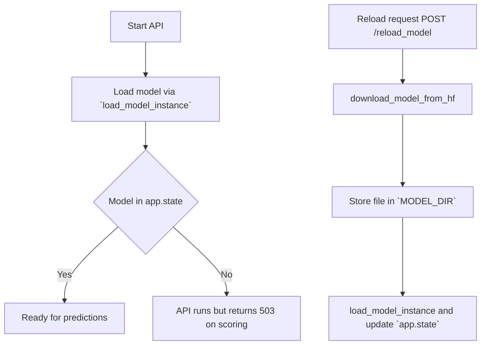
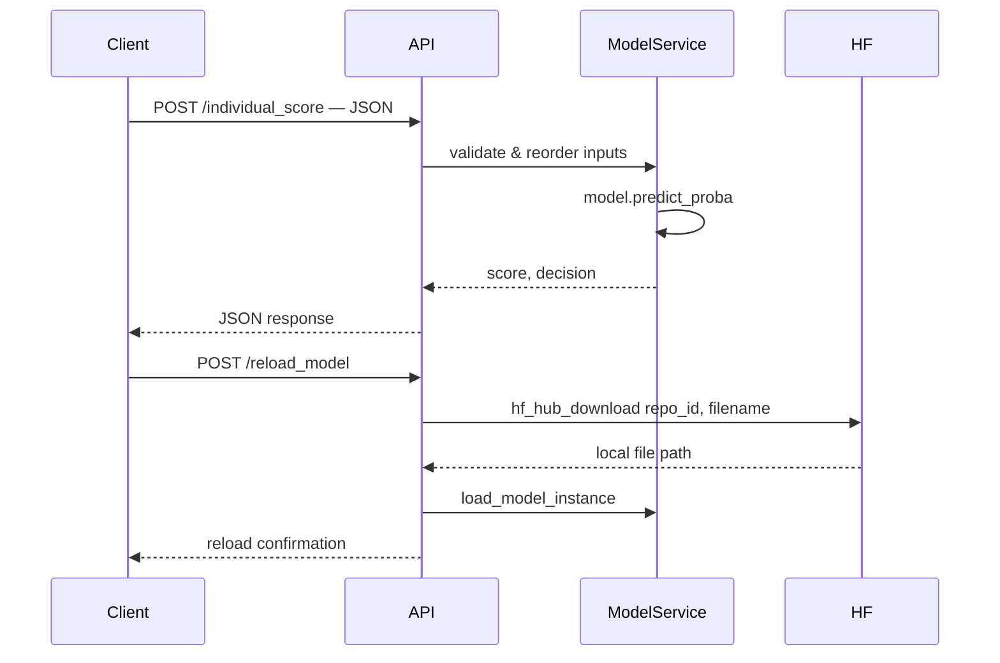

<!-- Project title and badges -->
# 🚀 Pret-à-Dépenser

[](https://www.python.org/)
[](https://fastapi.tiangolo.com/)
[](https://mlflow.org/)
[](https://catboost.ai/)
[](https://huggingface.co/)

**Packaging et déploiement d'un modèle CatBoost avec MLflow et Hugging Face Hub.**

---

## 🎯 Objectif

Automatiser une chaîne reproductible pour déployer un modèle CatBoost :
- Enregistrement/versioning via MLflow
- Export des artifacts essentiels (`model.cb`, `MLmodel`, `input_example.json`)
- Publication et téléchargement depuis Hugging Face Hub
- Fournir une API HTTP via FastAPI pour la prédiction et la gestion du modèle

---

## ✨ Fonctionnalités

- ✅ API FastAPI minimale pour health, inspection et scoring
- ✅ Chargement automatique du modèle au démarrage (injection dans `app.state`)
- ✅ Endpoints pour signature, info, statut et reload depuis HF
- ✅ Prédiction individuelle et batch avec validation Pydantic
- ✅ Scripts d'upload/download vers/depuis Hugging Face Hub

---

## 📡 Endpoints exposés

L'application FastAPI se trouve dans `src/api/main.py` et expose les routes suivantes (sans préfixe). Le frontend Streamlit se trouve dans `src/app/main.py` et communique avec l'API pour afficher l'interface utilisateur :

- `GET /` → redirection vers la documentation interactive `/docs`.
- `GET /api_health` → état de santé global de l'API.

Routes du routeur (`src/api/routes.py`):
- `GET /router_health` → health du router.
- `GET /model_status` → état du fichier modèle sur disque (`model.cb`).
- `GET /model_signature` → colonnes attendues (signature MLflow) et nombre de features.
- `GET /model_info` → métadonnées (version, date, threshold recommandé).
- `POST /individual_score` → prédiction pour un individu (Pydantic)
- `POST /multiple_score` → prédictions en batch (liste d'objets Pydantic)
- `POST /reload_model` → télécharge le fichier `HF_FILENAME` depuis `HF_REPO_ID` et recharge le modèle en mémoire.

Exemple de payload (utilisez l'exemple depuis le schema `ScoringData` dans `src/app/schemas.py`):

```json
{
	"FE_EXT_SOURCE_MEAN": 0.5892,
	"BURO_MONTHS_BALANCE_SIZE_MEAN": 0.0,
	"CODE_GENDER": 0,
	"INSTAL_DPD_MEAN": 0.0,
	"BURO_MONTHS_BALANCE_MAX_MIN": 0.0,
	"FE_GOODS_CREDIT_RATE": 1.0,
	"APPROVED_CNT_PAYMENT_MEAN": 0.0,
	"YEARS_BIRTH": 59,
	"YEARS_EMPLOYED": 0,
	"AMT_ANNUITY": 20952.0,
	"NAME_FAMILY_STATUS_Married": true,
	"INSTAL_AMT_PAYMENT_SUM": 0.0,
	"FE_EXT_SOURCE_MIN": 0.2635,
	"PREV_CNT_PAYMENT_MEAN": 0.0,
	"FE_EXT_SOURCE_MAX": 0.7992
}
```

Réponse de prédiction (exemple):

```json
{
	"score": 0.1234,
	"prediction": 0,
	"threshold": 0.5,
	"decision": "Accordé"
}
```

---

## 📁 Architecture & diagrammes

**Arborescence principale**

```
Pret-à-Dépenser/
│
├── ⚙️ config/                        # Paramètres, chemins et logger
│   ├── __init__.py
│   ├── config.py
│   └── logger.py
│
├── 📦 exported_model/                # Artifacts exportés (à ignorer)
│   ├── MLmodel
│   ├── model.cb
│   ├── input_example.json
│   └── requirements.txt
│
├── 📂 data/
│   ├── external/
│   ├── raw/
│   └── processed/
│
├── 🧰 scripts/                       # CLI helpers pour MLflow & HF
│   ├── download_model_from_hf.py
│   ├── upload_model_to_hf.py
│   └── __init__.py
│
├── 💻 src/
│   ├── app/
│   │   ├── main.py
│   │   ├── routes.py
│   │   ├── model.py
│   │   └── schemas.py
│   ├── model/
│   │   ├── hf_interaction.py
│   │   ├── mlflow_interaction.py
│   │   └── model_service.py
│   ├── data_prep/
│   └── utils/
│
├── 🧪 tests/
├── 🧾 README.md
├── 📜 pyproject.toml
├── 📦 requirements.txt
├── 🐳 Dockerfile
└── 🐳 docker-compose.yml
```

**Architecture (flow principal)**





---

## ⚙️ Variables d'environnement (importantes)

- `HF_REPO_ID` — identifiant du repo HF (ex: `username/model-repo`) requis pour `POST /reload_model`.
- `HUGGINGFACE_TOKEN` — token HF (ou `HF_TOKEN`) pour accéder au repo privé.
- `HF_FILENAME` — nom du fichier dans le repo HF (défaut `model.cb`).
- `MLFLOW_TRACKING_URI` — (optionnel) point vers le serveur MLflow.

Ces variables peuvent être mises dans `.devenv` (utilisé par le projet) ou exportées dans votre CI.

---

## 🧰 Installation rapide

Prerequis: Python 3.13+

```bash
python -m venv .venv
.venv\Scripts\activate   # Windows
pip install -e .
```

Le projet s'appuie sur les dépendances listées dans `pyproject.toml`.

### Lancer l'API localement (dev)

La workspace contient une task pour démarrer l'API :

```bash
uv run uvicorn src.api.main:app --host 0.0.0.0 --port 8000 --reload
```

L'UI interactive est disponible sur `http://localhost:8000/docs`.

### Lancer le frontend Streamlit (dev)

Le projet contient aussi une application Streamlit pour une UI de scoring. Vous pouvez la lancer avec la task VS Code ou la commande suivante :

```bash
uv run streamlit run src/app/main.py
```

L'interface Streamlit est accessible par défaut sur `http://localhost:8501`.

### Lancer MLflow (optionnel)

```bash
mlflow server --host 0.0.0.0 --port 5000
```

---

## 🐳 Docker

Le `Dockerfile` du projet utilise le gestionnaire `uv` (voir Dockerfile). Le `docker-compose.yml` expose le port `8000`.

---

## 🧪 Tests

Utilisez `pytest` pour lancer la suite de tests (si présente) :

```bash
pytest -q
```

---

## 👤 Auteur & remerciements

**Fabien** - [RandomFab](https://github.com/RandomFab)

Merci aux bibliothèques et projets open-source utilisés : FastAPI, MLflow, CatBoost, HuggingFace Hub.
